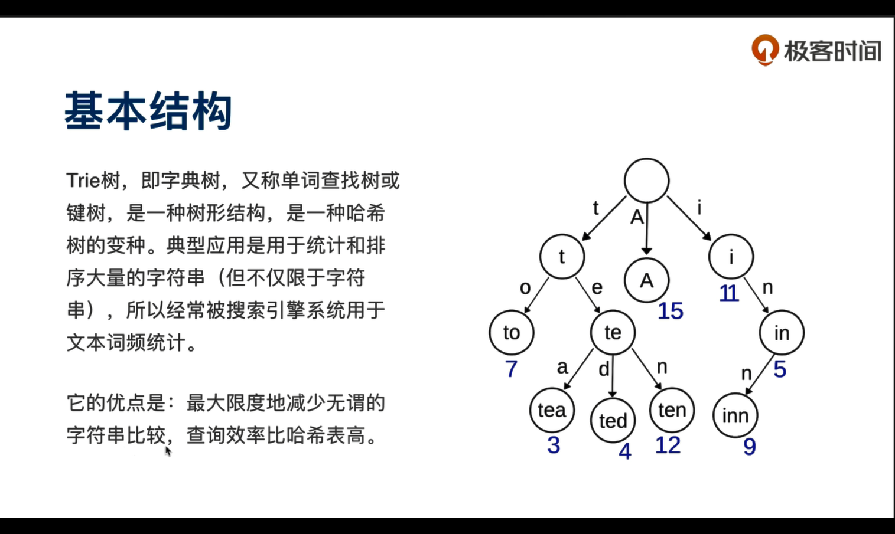
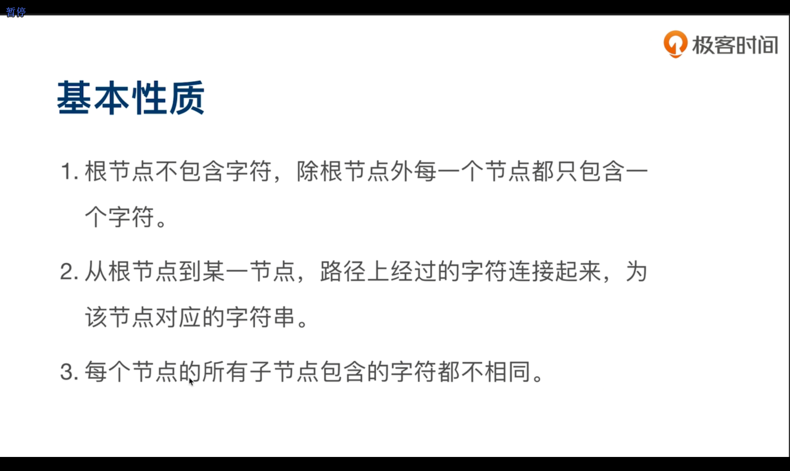

# 字典树 Trie树
动画理解trie数： https://juejin.im/post/5c2c096251882579717db3d2

一种树形结构，又称单词查找树，是一种树形结构，哈希树的变种。
节点不存储元素，只存储在边，记录下走过的边，即得到查询结果。

## 主要应用
统计和排序大量字符串，经常被搜索引擎用于词频统计。
- 字符串检索：事先将已知的一些字符串（字典）的有关信息保存到 Trie 里，查找另外一些未知字符串是否出现过或者出现频率。
- 字符串最长公共前缀：Trie 利用多个字符串的公共前缀来节省存储空间，反之，当我们把大量字符串存储到一棵 Trie 上时，我们可以快速得到某些字符串的公共前缀。
- 排序：Trie 树是一棵多叉树，只要先序遍历整棵树，输出相应的字符串，便是按字典序排序的结果。
- 作为其他数据结构和算法的辅助结构：如后缀树，AC自动机等。

## 优点
最大限度地减少无谓的字符串比较，查询效率比哈希表高

## 核心思想
以空间换时间，利用字符串的公共前缀来降低查询时间的开销。

## 基本性质

